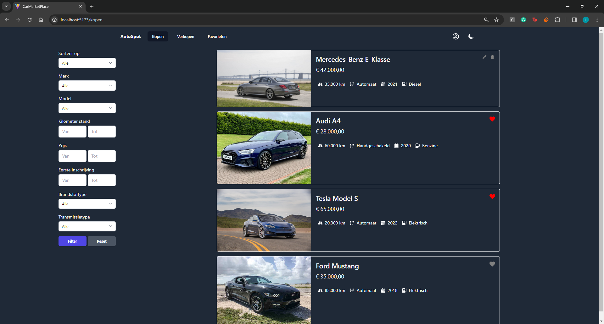
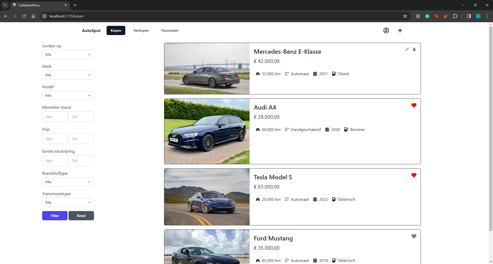
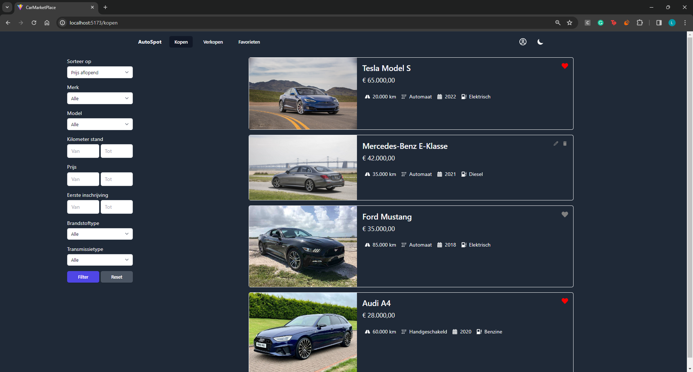
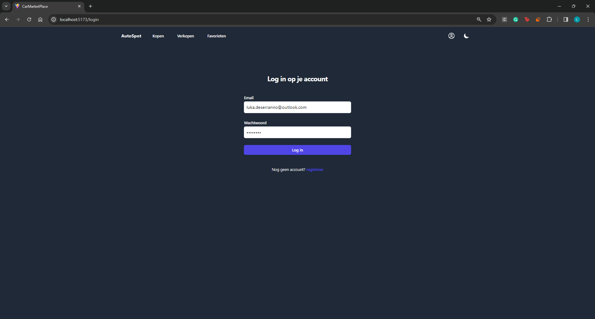
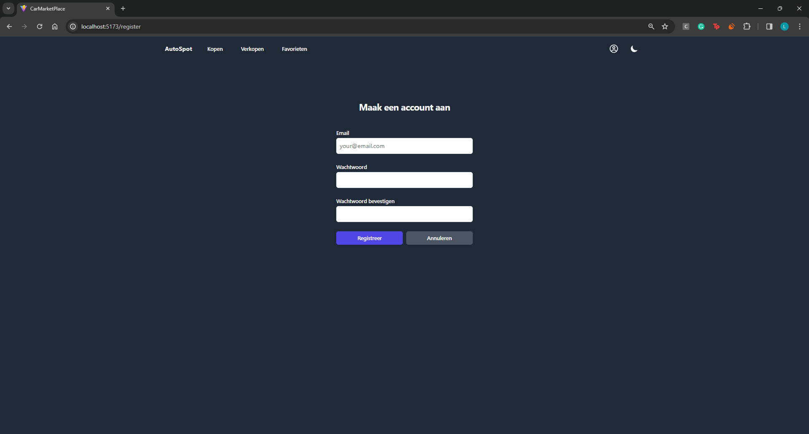
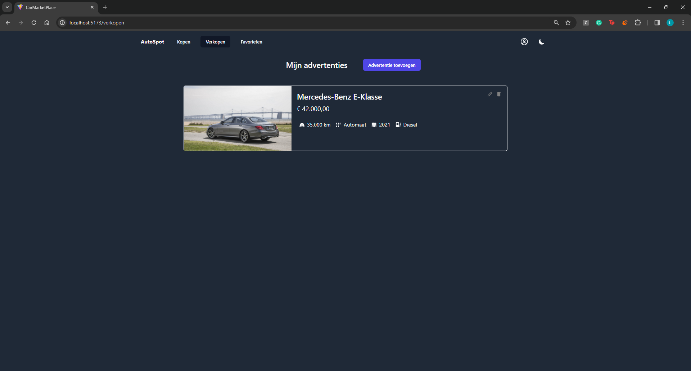
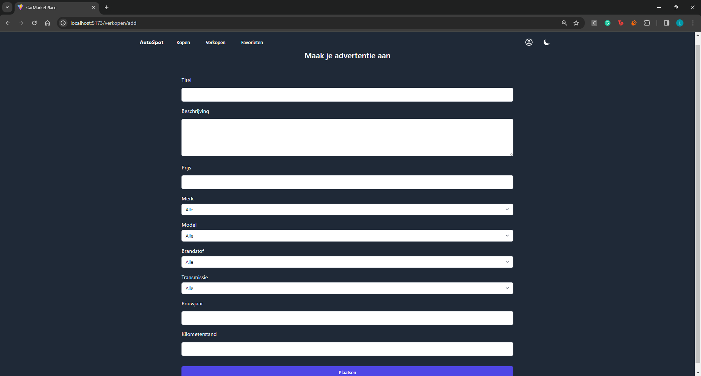
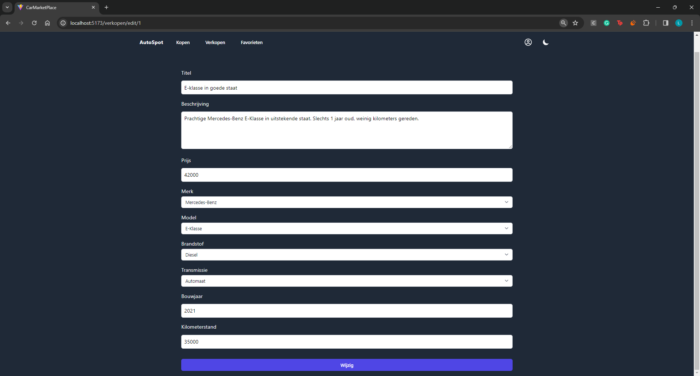
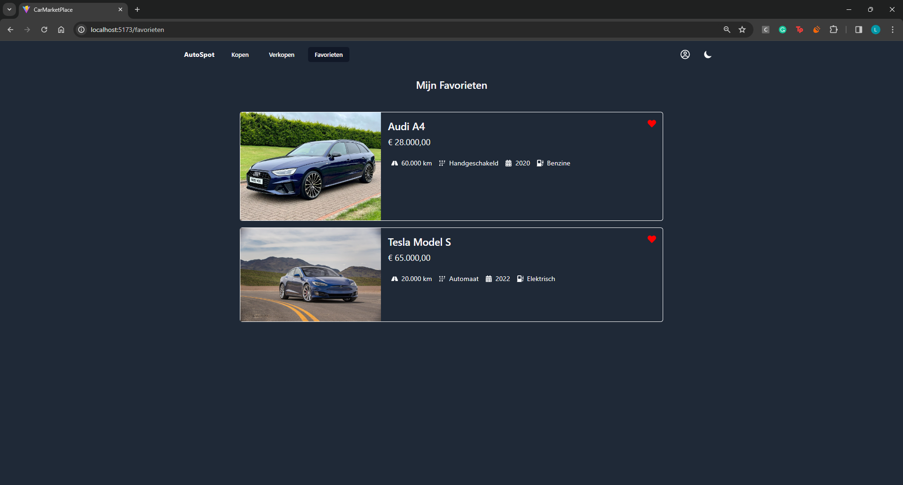

# Luka Deserranno (202293301)

- [x] Front-end Web Development
  - https://github.com/Web-IV/2324-frontendweb-LukaDeserranno
  - https://two324-frontendweb-lukadeserranno.onrender.com
- [x] Web Services:
  - https://github.com/Web-IV/2324-webservices-LukaDeserranno
  - https://two324-webservices-lukadeserranno.onrender.com

**Logingegevens**

- e-mailadres: luka.deserranno@outlook.com
- Wachtwoord: 12345678

## Projectbeschrijving

Het is de bedoeling dat deze applicatie gebruikt wordt om 2dehands auto's aan te bieden. Je kunt op de verkopen pagina alle auto's terug vinden die mensen hebben toegevoegd. Daarnaast kun je zelf ook je auto aanbieden. Ook kun je favorieten terug vinden of door op de auto die je leuk vind te klikken contact leggen met de verkoper.

## Screenshots

### Toegangsscherm wanneer je naar de url surft

### Light mode

### De auto lijst gesorteerd op prijs aflopend

### Login pagina

### Registreer pagina

### Verkopen pagina

### Pagina na het klikken op advertentie toevoegen

### Pagina na het klikken op het potlood

### Favorieten pagina

## API calls

### Gebruikers

- `GET /api/users`: alle gebruikers ophalen
- `GET /api/users/:id`: gebruiker met een bepaald id ophalen
- `PUT /api/users/:id`: user met een bepaalde id aanpassen
- `DEL /api/users/:id`: gebruiker met een bepaald id verwijderen
- `POST /api/users/login`: user inloggen
- `POST /api/users/register`: user registreren

## Advertenties

- `GET /api/adverts`: alle advertenties ophalen
- `GET /api/adverts/:id`: advertentie met bepaalde id ophalen
- `GET /api/adverts/user/:id`: alle advertenties van een bepaalde gebruiker met id ophalen
- `GET /api/adverts/favorites/:id`: alle favoriete advertenties van een bepaalde gebruiker ophalen
- `POST /api/adverts`: nieuwe advertentie aanmaken
- `PUT /api/adverts/:id`: een advertentie met bepaalde id aanpassen

## Merken

- `GET /api/brands`: alle merken ophalen

## Modellen

- `GET /api/models`: alle modellen ophalen

## Brandstoftypes

- `GET /api/fuel`: alle brandstoftypes ophalen

## Transmissietypes

- `GET /api/transmission`: alle transmissietypes ophalen

## Favorieten

- `POST /api/favorites/`: een nieuwe favoriet toevoegen
- `DEL /api/favorites/:id`: een favoriet verwijderen

## Email

- `POST /api/email`: een email versturen

## Fotos
- `GET /api/photos/first/:id`: de eerste foto van een advertentie ophalen

## Behaalde minimumvereisten

### Front-end Web Development

- **componenten**

  - [x] heeft meerdere componenten - dom & slim (naast login/register)
  - [x] applicatie is voldoende complex
  - [x] definieert constanten (variabelen, functies en componenten) buiten de component
  - [x] minstens één form met meerdere velden met validatie (naast login/register)
  - [x] login systeem
 

- **routing**

  - [x] heeft minstens 2 pagina's (naast login/register)
  - [x] routes worden afgeschermd met authenticatie en autorisatie
 

- **state-management**

  - [x] meerdere API calls (naast login/register)
  - [x] degelijke foutmeldingen indien API-call faalt
  - [x] gebruikt useState enkel voor lokale state
  - [x] gebruikt gepast state management voor globale state - indien van toepassing
 

- **hooks**

  - [x] gebruikt de hooks op de juiste manier
 

- **varia**

  - [x] een aantal niet-triviale e2e testen
  - [x] minstens één extra technologie
  - [x] maakt gebruik van de laatste ES-features (async/await, object destructuring, spread operator...)
  - [x] duidelijke en volledige README.md
  - [x] volledig en tijdig ingediend dossier en voldoende commits

### Web Services

- **datalaag**

  - [x] voldoende complex (meer dan één tabel, 2 een-op-veel of veel-op-veel relaties)
  - [x] één module beheert de connectie + connectie wordt gesloten bij sluiten server
  - [x] heeft migraties - indien van toepassing
  - [x] heeft seeds
 

- **repositorylaag**

  - [x] definieert één repository per entiteit (niet voor tussentabellen) - indien van toepassing
  - [x] mapt OO-rijke data naar relationele tabellen en vice versa - indien van toepassing
 

- **servicelaag met een zekere complexiteit**

  - [x] bevat alle domeinlogica
  - [x] bevat geen SQL-queries of databank-gerelateerde code
 

- **REST-laag**

  - [x] meerdere routes met invoervalidatie
  - [x] degelijke foutboodschappen
  - [x] volgt de conventies van een RESTful API
  - [x] bevat geen domeinlogica
  - [x] geen API calls voor entiteiten die geen zin hebben zonder hun ouder (bvb tussentabellen)
  - [x] degelijke authorisatie/authenticatie op alle routes
 

- **algemeen**

  - [x] er is een minimum aan logging voorzien
  - [x] een aantal niet-triviale integratietesten (min. 1 controller >=80% coverage)
  - [x] minstens één extra technologie
  - [x] maakt gebruik van de laatste ES-features (async/await, object destructuring, spread operator...)
  - [x] duidelijke en volledige README.md
  - [x] volledig en tijdig ingediend dossier en voldoende commits

## Projectstructuur

### Front-end Web Development

binnen de src map zit alle logica voor api calls in de api map, alle losse componenten vallen onder de map componenten en de verschillende paginas zitten onder de pages map

### Web Services

de seeding en databank gerelateerde zaken zitten in de prisma map, binnen de src map heb je de rest waar alle endpoints worden verzorgd en de services die de data die in de rest binnen komt afhandeld. In de test map zijn alle testen terug te vinden.

## Extra technologie

### Front-end Web Development

Tailwind CSS
- https://www.npmjs.com/package/tailwindcss
- https://tailwindcss.com/

### Web Services

Prisma ORM
- https://www.npmjs.com/package/prisma
- https://www.prisma.io/docs/

## Testresultaten

### Front-end Web Development

Testen om te zien of de sortering klopt
- should check if car list is sorted by price ascpassed
- should check if car list is sorted by price descpassed
- should check if car list is sorted by mileage ascactive
- should check if car list is sorted by mileage descprocessing
- should check if car list is sorted by buildyear ascprocessing
- should check if car list is sorted by buildyear desc

Test om te zien of toevoegen van advertentie lukt
- should submit the form with valid data

### Web Services

### Advert API
GET /api/adverts                                                                                                                                                
- should 200 and return all adverts (30 ms)                                                                                                                   
- should 400 when given an argument (16 ms)                                                                                                            
GET /api/adverts/:id                                                                                                                                            
- should 200 and return advert with id 1 (8 ms)                                                                                                               
- should 400 when /:id is not a number (4 ms)                                                                                                                 
-  should 404 when advert with id 25 does not exist (10 ms)                                                                                                    
GET /api/adverts/user/:id                                                                                                                                       
-  should 200 and return adverts for user with id 1 (8 ms)                                                                                                     
-  should 400 when /:id is not a number (4 ms)                                                                                                                 
-  should 404 when user with id 25 does not exist (5 ms)                                                                                                       
GET /api/adverts/favorites/:id                                                                                                                                  
-  should 200  and return favorite adverts for user with id 1 (7 ms)                                                                                           
-  should 400 when /:id is not a number (5 ms)                                                                                                                 
-  should 404 when user with id 25 does not exist (4 ms)                                                                                                       
POST /api/adverts                                                                                                                                               
-  should 200 and create a new advert (20 ms)                                                                                                                  
-  should 400 when given an invalid advert object (4 ms)                                                                                                       
-  should 400 when given an invalid argument (4 ms)                                                                                                            
PUT /api/adverts/:id                                                                                                                                            
-  should 200 and update advert with id 1 (9 ms)                                                                                                               
-  should return 400, invalid argument (5 ms)                                                                                                                  
-  should return 404, advert with id 25 does not exist (11 ms)                                                                                                 
-  should return 400, invalid advert object (6 ms)                                                                                                             
DELETE /api/adverts/:id                                                                                                                                         
-  should 200 and delete advert with id 1 (6 ms)                                                                                                               
-  should 400, invalid argument (3 ms)                                                                                                                         
-  should 404, advert with id 25 does not exist                                                                                                                                                                                                                                                                                                                                                                                                    
### Users
GET /api/users                                                                                                                                                  
-  should 200 and return all users (10 ms)                                                                                                                     
-  should 400 when given an argument (16 ms)                                                                                                                   
-  it should 401 when no authorization token provided (8 ms)                                                                                                   
-  it should 401 when invalid authorization token provided (4 ms)                                                                                              
GET /api/users/:id                                                                                                                                              
-  should 200 and return the requested user (6 ms)                                                                                                             
-  should 400 with invalid user id (4 ms)                                                                                                                      
-  it should 401 when no authorization token provided (7 ms)                                                                                                   
-  it should 401 when invalid authorization token provided (4 ms)                                                                                              
POST /api/users/register                                                                                                                                        
-  should 200 and return the created user (202 ms)                                                                                                             
-  should 400 with invalid email (5 ms)                                                                                                                        
PUT /api/users/:id                                                                                                                                              
-  should 200 and return the updated user (8 ms)                                                                                                               
-  should 404 with not existing user (12 ms)                                                                                                                   
-  should 403 when not admin (5 ms)                                                                                                                            
-  it should 401 when no authorization token provided (4 ms)                                                                                                   
-  it should 401 when invalid authorization token provided (3 ms)                                                                                              
DELETE /api/users/:id                                                                                                                                           
-  should 204 and delete the user (8 ms)                                                                                                                       
-  should 400 with invalid user id (4 ms)                                                                                                                      
-  should 404 with not existing user (7 ms)                                                                                                                    
-  should 403 when not admin (4 ms)                                                                                                                            
-  it should 401 when no authorization token provided (3 ms)                                                                                                   
-  it should 401 when invalid authorization token provided (3 ms)                                                                                              

GET /api/health/ping                                                                                                                                            
-  should return pong (13 ms)                                                                                                                                  
-  should 400 with unknown query parameters (13 ms)                                                                                                            
GET /api/health/version                                                                                                                                         
-  should return version from package.json (3 ms)                                                                                                              
-  should 400 with unknown query parameters (6 ms)                                                                                                             
    General                                                                                                                                                         
-  should return 404 when accessing invalid url (2 ms)                                                                                                         
                                                                                                                           
### Brand API
GET api/brands                                                                                                                                                  
-  should 200 and return all brands (11 ms)                                                                                                                    
-  should 400 when given an argument (13 ms)                                                                                                                   

GET api/transmission                                                                                                                                            
- should 200 and return all transmissiontypes (11 ms)                                                                                                         
- should 400 when given an argument                                                                                                                                                                                                                                            
### Fueltype API
 GET api/fuel                                                                                                                                                    
- should 200 and return all models                                                                                                                 
- should 400 when given an argument

### Model API
GET api/models
- should 200 and return all models
- should 400 when given an argument

## Gekende bugs

### Front-end Web Development

geen bugs

### Web Services

geen bugs